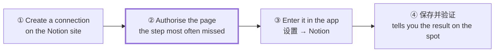
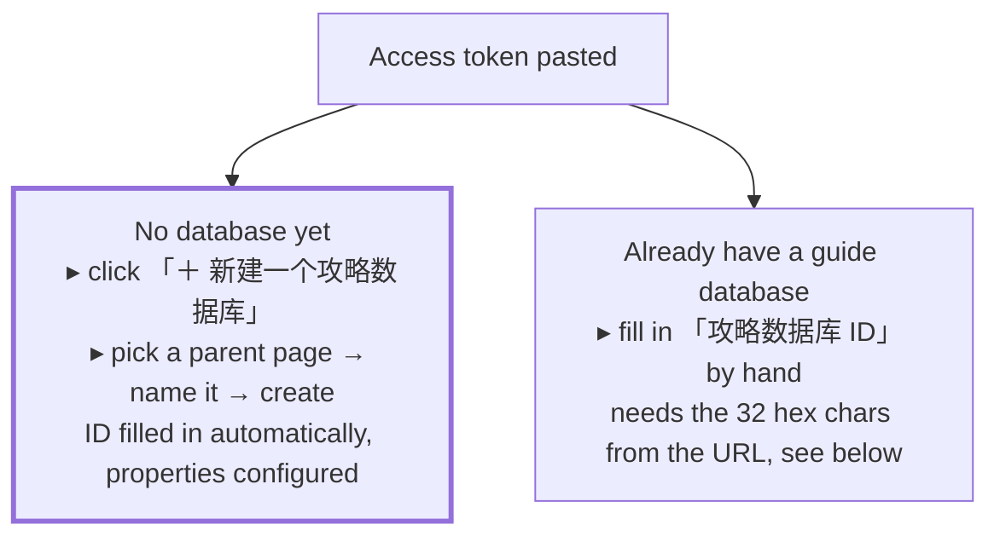

# Connecting Notion

Once connected, the program writes generated guides into your Notion and ticks the matching checkboxes as you unlock achievements.

Four steps, about 10 minutes, all of it in the browser and the program's own UI. **No command line required.**

> This is the operator's walkthrough. For the rules behind checkbox sync and status convergence, see [guides.md](guides.md). For what each setting means, see [configuration.md](configuration.md).
>
> **UI labels are quoted verbatim in Chinese**, because that is what the buttons actually say.



Step ② is called out separately because the overwhelming majority of "it won't connect" reports come from there — the connection was created, but no page was ever shared with it.

---

## ① Create a connection in Notion

Open the [developer page](https://app.notion.com/developers/connections) → **New connection**.

- **Name** — anything, e.g. `Steam 攻略`
- **Authentication method** — stick with `Access token`


Once created, go to the **Configuration** tab. It holds an **Access token** starting with `ntn_` or `secret_`. Click **Show** → **Copy** and keep it somewhere for step ③.


> **The older UI uses different words for these**: `New connection` was `New integration`, `Access token` was `Internal Integration Secret` (shown directly on the page after creation, not in a Configuration tab), and the developer page was at `notion.so/my-integrations`. They are the same things.
>
> Notion has renamed these more than once, so **if the words on screen don't match this page, follow the screen.** The program cares about neither the name nor the prefix — it accepts both `ntn_` and `secret_`.

> **This string is the key to your Notion.** Don't send it to anyone or paste it into a chat. The program stores it only in `config.json` on your own machine (mode 600).

---

## ② Share the page with it

Create a new page in the left sidebar. Name it whatever you like, e.g. "Steam games", then click **Empty page**.


Open the page you intend to keep guides under, then:

```
top-right of the page
   ••• (More)
      └─ Add connections
            └─ search for the name you used in step ① → select it
```

Some Notion versions require clicking "+ Add connections" first.

**How to tell it worked**: your connection's name now appears in that page's `•••` menu.

**Authorising a parent page authorises every page beneath it** — so pick a high enough page and do it once, rather than clicking through page by page.


---

## ③ Back in the app: pick one of two routes

Open the program → **⚙️ 设置** (top right) → click through to the **Notion** step on the step bar.

Paste the token from step ① into **Access token**. From there, two routes:



**The left route never touches a URL and cannot be filled in wrong** — take it if you have no existing database. The program creates the database along with all four status options and writes the ID straight into the config.

### If you take the right route: getting the database ID

Open the database **as a full page** in Notion (not a small table embedded in another page), then look at the address bar:

```
https://app.notion.com/p/Steam-Game-3cc90c1c4bd680089a1dff2a79a88148?pvs=12
                                    └───── these 32 characters ─────┘ └─ drop everything after '?'
```

Take the pure hexadecimal run before the `?` (only `0-9` and `a-f`). **Drop the title and the hyphens.**

Three common mistakes:

| Entered | Why it fails |
|---|---|
| The whole link | It carries the title and query parameters too |
| The part after `?v=` | That is a **view** ID, not a database ID |
| The page ID | Easy to copy the outer page's ID when the database is embedded in a page |

Getting it wrong is not a problem: on save, the program tells you separately whether this is "not a database" or "not shared with the connection" — the fixes are completely different, so it never merges them into one vague sentence.

---

## ④ 保存并验证


On success it should say something like:

> 建好了:「Steam 攻略」,状态选项 Not started / In progress / Staged / Done。ID 已填好并存盘。

Press **「保存并验证」**. The program asks everything it needs to ask right then, rather than failing later when you first generate a guide:

| What it checks | What happens if it's wrong |
|---|---|
| Whether the token works | Says the token is unusable |
| Whether the ID really points at a database | Reports "not a database" and "not shared" separately |
| Whether there is a title property | States exactly what is missing |
| Whether the status options are complete | If not, a **「帮我补上」** button appears — one click fills them in |
| Whether it can actually write | Creates a page and immediately archives it; a read-only connection is reported on the spot |

If everything passes, it returns to the Dashboard automatically. If anything fails, the page **stays here** and lists the problems rather than navigating away — each one says specifically how to fix it.

> The last row is worth calling out: a read-only inspection cannot detect "this connection only has read permission," and that particular fault stays green all the way to a 403 on your first guide generation. So it genuinely creates a page and archives it again.

### About the status options

The program writes four statuses to guide pages: `Not started`, `In progress`, `Staged`, `Done`.

Three of those — `Not started` / `In progress` / `Done` — are **Notion's own defaults** when you create a status property, so a hand-made database is usually short only `Staged`, which is exactly the case 「帮我补上」 handles in one click.

**Statuses you added yourself (say `Paused`) are never touched.** Validation only asks whether the value being written this time is among the options; it does not care what else is in there.

---

## What happens once it's connected

- Games with no guide get a **✨ 生成** button at the end of the row — provided you also configured AI (step ② in settings)
- When you unlock an achievement on Steam, the program ticks the matching checkbox in the Notion guide
- Completing a game marks its guide page `Done`; if the developer adds achievements and it drops below 100%, it goes back to `Staged`
- All of this runs automatically when you open the Dashboard and when you press 「立即同步」 — nothing to manage

## Command line (optional)

If you have Node installed and want to check from a terminal:

```bash
node tracker.js notion-check                # read-only health check: token, database, title property, status options, page count
node tracker.js notion-check --fix          # try to add the missing status options
node tracker.js notion-check --probe-write  # create a page and archive it, to prove write access
node tracker.js init --notion --create      # the command-line version of 「新建一个攻略数据库」
```

Users of the packaged build need none of this — 「保存并验证」 on the settings page runs the same checks.
