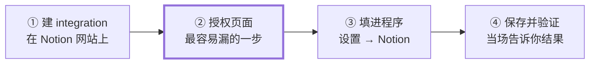
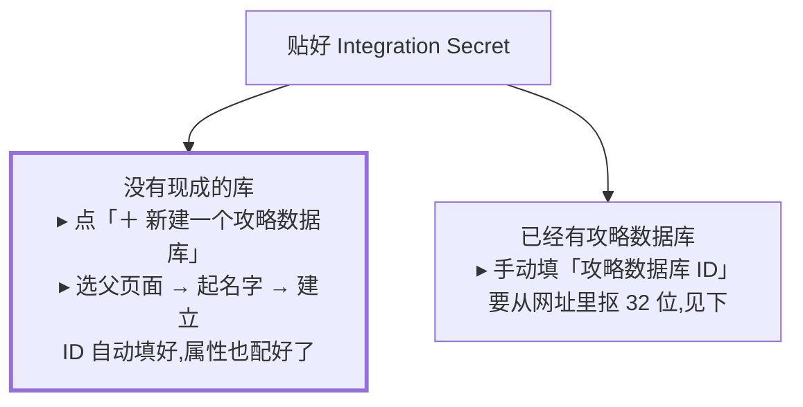

# 连接 Notion 攻略库

连上之后,程序会把生成的攻略写进你的 Notion,并且在你解锁成就时自动勾上攻略里对应的复选框。

四步,大约 10 分钟,全程在浏览器和程序界面里完成,**不需要用命令行**。

> 这是给使用者看的操作步骤。想了解勾选同步和状态收敛的规则,看 [guides.md](guides.md);
> 每个配置项的含义在 [configuration.md](configuration.md)。



第 ② 步单独标出来,是因为绝大多数「连不上」都出在那里 —— 建了 integration,但没把页面授权给它。

---

## ① 在 Notion 建一个 integration

打开 [notion.so/my-integrations](https://www.notion.so/my-integrations) → **New integration**。

- **Name** 随便填,比如 `Steam 攻略`
- **Type** 选 **Internal**
- **Associated workspace** 选你放攻略的那个工作区

建好之后页面上会有一串 **Internal Integration Secret**,`ntn_` 或 `secret_` 开头。点 **Show** → **Copy**,先存到记事本里,第 ③ 步要用。

> **如果你的 Notion 把 integration 叫成 connection**:是同一个东西。Notion 的开发者文档已经改用
> `connection` 这套词(密钥叫 *installation access token*,在 **Configuration** 标签页里),但产品界面
> 上的按钮仍然写着 **New integration**。哪边的字和这里对不上,按你屏幕上的走 —— 程序两种都收,
> 它不认前缀也不认叫法。

> **这串东西等于你 Notion 的钥匙**,别发给别人、别贴到聊天里。程序只把它存在你自己电脑上的 `config.json`(权限 600)。

---

## ② 把页面授权给它

**这一步漏了,后面一定连不上。** 刚建好的 integration 默认**什么都看不见** —— 哪怕它属于你自己的工作区。你得明确告诉 Notion「这个 integration 可以碰这一页」。

在 Notion 里打开你打算放攻略的那一页,然后:

```
页面右上角
   ••• (更多)
      └─ 连接 / Connections
            └─ 搜你第 ① 步起的名字 → 选中
```

有的 Notion 版本要先点「+ 添加连接」。

**怎么知道成功了**:那一页的 `•••` 菜单里会出现你这个 integration 的名字。

**授权父页面之后,它底下所有子页面都跟着授权了** —— 所以选一个够高的页面授权一次就够,不用一页页点。

---

## ③ 回到程序里填,选一条路

打开程序 → 右上角 **⚙️ 设置** → 上面的步骤条点到 **Notion** 这一步。

把第 ① 步复制的密钥贴进 **Integration Secret**。接下来有两条路:



**左边这条路不用碰网址,也不会填错** —— 没有现成库的话就走它。程序会把数据库连同四个状态选项一起建好,ID 直接写进配置。

### 如果走右边:数据库 ID 怎么取

在 Notion 里**把数据库整页打开**(不是嵌在别的页面里的那种小表格),然后看浏览器地址栏:

```
https://notion.so/我的攻略库-3bd1fee6252b816da1ccf9c50b8e91c2?v=8a2f...
                            └────────── 要的就是这 32 位 ──────────┘  └─ ? 之后全不要
```

取 `?` 前面那段纯十六进制(只有 `0-9` 和 `a-f`),**标题和连字符都不要**。

三种常见的填错:

| 填成了 | 为什么不行 |
|---|---|
| 整条链接 | 里面混着标题和查询参数 |
| `?v=` 后面那段 | 那是**视图** ID,不是数据库 ID |
| 页面 ID | 数据库嵌在页面里时容易抄成外层页面的 ID |

填错了不用担心:保存时程序会分别告诉你是「这不是一个数据库」还是「还没授权给 integration」—— 这两件事修法完全不同,所以它不会合成一句含糊的话。

---

## ④ 保存并验证

按 **「保存并验证」**。程序会当场把该问的一次问完,而不是等你以后生成攻略时才报错:

| 它检查什么 | 不对的话会怎样 |
|---|---|
| 密钥能不能用 | 直接说密钥不可用 |
| 这个 ID 是不是真的指向数据库 | 把「不是数据库」和「没授权」分开告诉你 |
| 有没有标题属性 | 说清楚缺什么 |
| 状态选项齐不齐 | 缺的话旁边出现**「帮我补上」**,点一下自动补 |
| 能不能写进去 | 建一个页面再立刻归档来验证,只有读权限会当场报出来 |

全都通过就会自动跳回 Dashboard。有问题的话页面会**停在这里**把问题列出来,不会跳走 —— 每一条都写了具体怎么修。

> 最后一项值得单说:只读的检查查不出「这个 integration 只有读权限」,而那恰好能一路绿灯到第一次生成攻略才 403。所以这里会真的建一页再立刻归档掉。

### 关于状态选项

程序会往攻略页写四种状态:`Not started`、`In progress`、`Staged`、`Done`。

其中 `Not started` / `In progress` / `Done` 是 Notion 建状态属性时**自带的**,所以手工建的库通常只差一个 `Staged` —— 那正是「帮我补上」一键能搞定的情况。

**你自己另外加的状态(比如 `Paused`)程序永远不会去改。** 校验只问「这次要写的这个值在不在选项里」,不管里面还有什么。

---

## 连上之后会发生什么

- 没有攻略的游戏,行尾会出现 **✨ 生成** —— 前提是你也配了 AI(设置里的第 ② 步)
- 你在 Steam 解锁成就后,程序会自动勾上 Notion 攻略里对应的复选框
- 游戏打满会把攻略页标成 `Done`;开发者后来加了新成就、掉出 100%,会退回 `Staged`
- 这些都在打开 Dashboard 和点「立即同步」时自动跑,不用管

## 命令行(可选)

装了 Node、想从终端检查的话:

```bash
node tracker.js notion-check                # 只读体检:token、库、标题属性、状态选项、页面数
node tracker.js notion-check --fix          # 试着补上缺的状态选项
node tracker.js notion-check --probe-write  # 建一页再归档,验证真的有写权限
node tracker.js init --notion --create      # 命令行版的「帮我建一个」
```

打包版的用户不需要这些 —— 设置页里的「保存并验证」跑的是同一套检查。
